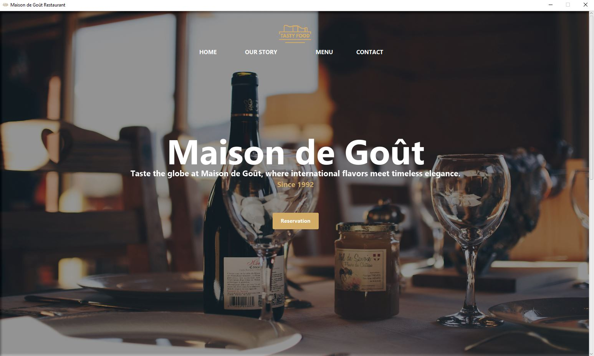
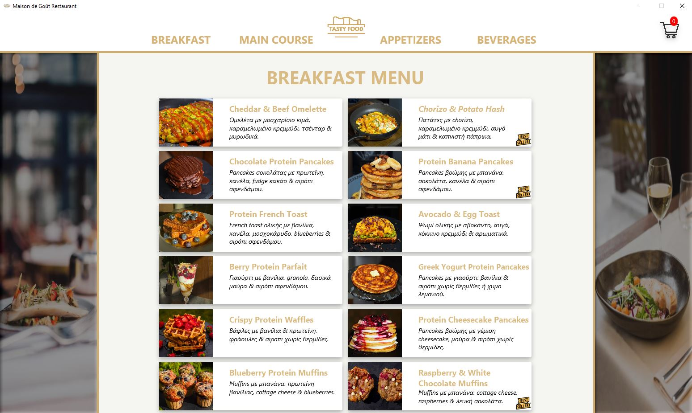
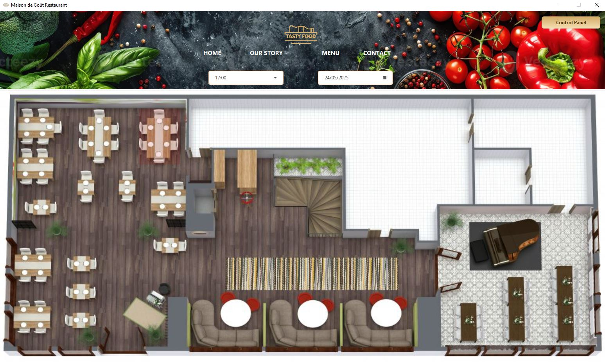

# Maison de Gout — Restaurant Management

JavaFX desktop application combining a restaurant customer interface with a management dashboard. Academic group project for **CN5004 — Advanced Programming (2025)**.

## Features
- Categorised menu, dish customisation, cart editing and order totals.
- Table reservations with date/time selection and a 3D restaurant layout.
- Administrative booking and order management, searching and filtering.
- Dashboard with revenue, order counts and popular dishes.
- CSV persistence and PDF order receipts using OpenPDF.
- Optional SMTP confirmation, cancellation and contact emails.

## Screenshots
Screenshots from the submitted project report.





## Run
Requires **JDK 23**, internet access for Maven dependencies, and a graphical desktop.

```powershell
.\mvnw.cmd clean javafx:run
```

On macOS/Linux: `chmod +x mvnw && ./mvnw clean javafx:run`.
JavaFX dependencies are resolved from `pom.xml`. Run from the project root so generated CSV files and receipts have a predictable location.

### Optional email configuration
Set `SMTP_USERNAME` and `SMTP_PASSWORD` in the process environment before starting. The code targets Gmail SMTP with STARTTLS on port 587; use credentials for your own account. `.env.example` documents the names but is not automatically loaded. Without configuration, email sending is disabled.

### Demo administration
The academic prototype uses the local demonstration login **admin / 2005**. This is not production authentication. Use fictional customer details when exploring the project.

## Publication notes
This is a cleaned copy of the submitted FinalVersion. Email credentials, saved bookings, order records, generated receipts, IDE files and build outputs are excluded. The Maven launcher module name was corrected. No per-author feature attribution is inferred.

This is an educational desktop prototype, not a production restaurant system. Local CSV storage and demo authentication need redesign before deployment. This publication copy has been statically reviewed; a fresh JDK 23 build and interactive run have not yet been verified in the publishing environment.

No additional open-source license is granted by this repository. Included imagery and other third-party assets retain their respective owners' rights.
